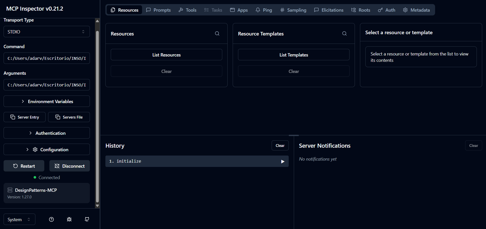
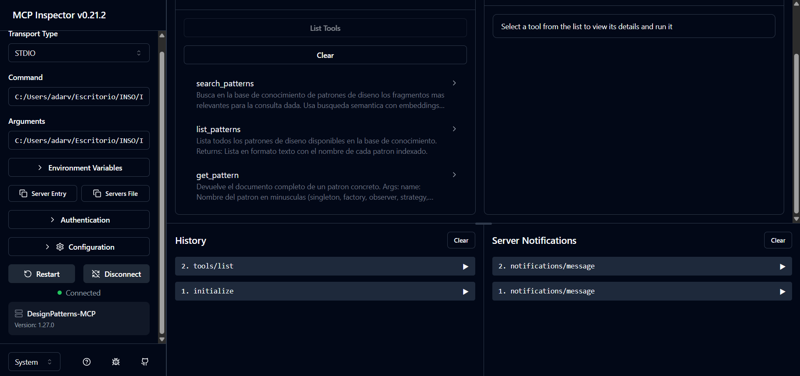
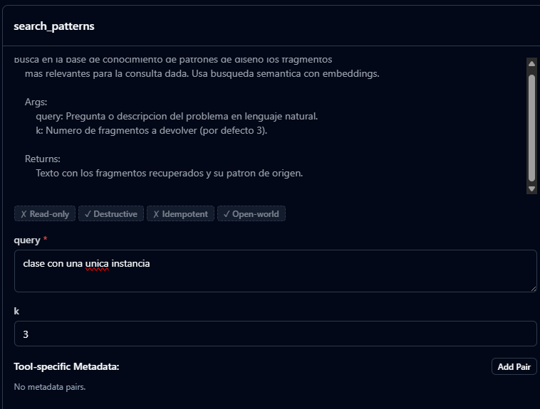
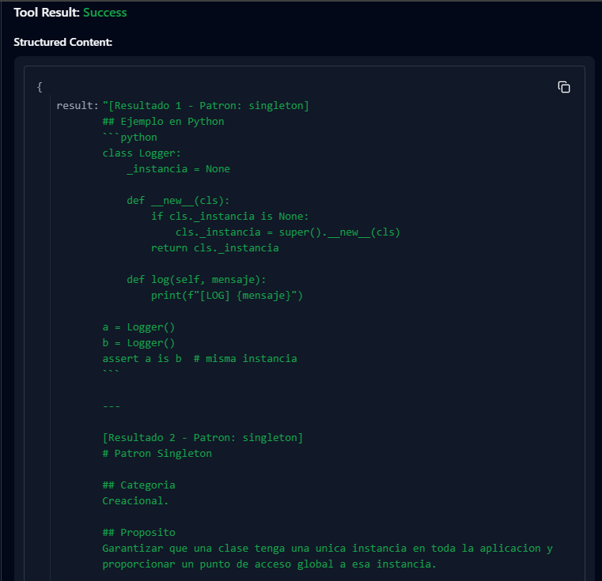
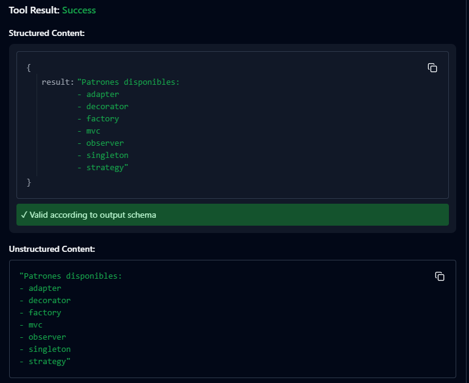

# DesignPatterns-MCP

Servidor MCP (Model Context Protocol) que expone una base de conocimiento RAG sobre patrones de diseño software. Cualquier cliente compatible con MCP (Claude Desktop, MCP Inspector, agentes personalizados) puede invocar sus herramientas para consultar los patrones por similitud semantica, listarlos o leer su documento completo.

---

## Unidades del curso aplicadas

- **Unidad 1 (IA Generativa y LLMs):** se utiliza `gemini-embedding-001` de Google como modelo de embeddings para vectorizar tanto los documentos indexados como las consultas que llegan al servidor. Se eligio Gemini por disponer de una capa gratuita suficiente para esta practica, manteniendo el mismo nivel de calidad que alternativas de pago para tareas de retrieval.
- **Unidad 3 (Transformers y APIs):** acceso programatico a la API de Google Generative AI a traves del paquete `langchain-google-genai`. La autenticacion se gestiona con una API key cargada desde un fichero `.env` y cualquier error de la API se propaga de forma controlada hasta el cliente MCP.
- **Unidad 5 (RAG y Bases Vectoriales):** pipeline RAG completo. Los documentos `.md` se cargan con `DirectoryLoader`, se trocean con `RecursiveCharacterTextSplitter` (chunks de 500 caracteres, solapamiento de 50, separadores que respetan los encabezados de markdown), se vectorizan con Gemini y se persisten en una base vectorial **ChromaDB** local en disco. Las consultas se resuelven mediante busqueda por similitud coseno con `k=3` por defecto.
- **Unidad 6 (Model Context Protocol):** servidor MCP implementado con el SDK oficial de Anthropic (`mcp` con el wrapper de alto nivel `FastMCP`). Expone **tres tools** documentadas con docstrings que el protocolo convierte automaticamente en `inputSchema` para los clientes. Comunicacion vía **stdio**, transporte estandar del protocolo.

Cobertura: **4 de 6 unidades** integradas de forma natural.

---

## Arquitectura

```
                          INGESTA (una sola vez)
   data/*.md ──> DirectoryLoader ──> RecursiveCharacterTextSplitter
                                          │
                                          ▼
                              GoogleGenerativeAIEmbeddings
                              (models/gemini-embedding-001)
                                          │
                                          ▼
                              ChromaDB persistente
                              (./chroma_db, coleccion design_patterns)


                          CONSULTA (cada vez que un cliente llama a una tool)
   [Cliente MCP]
   (Claude Desktop / MCP Inspector / custom)
        │
        │  protocolo MCP via stdio (JSON-RPC sobre stdin/stdout)
        ▼
   [src/server.py - FastMCP]
        │
        ├── search_patterns(query, k)  ──> embedding ──> Chroma similarity_search ──> chunks + fuente
        ├── list_patterns()            ──> listado de los .md disponibles
        └── get_pattern(name)          ──> contenido completo del fichero
```

El servidor arranca en cada sesion del cliente, carga la base ChromaDB ya persistida y queda escuchando en stdio. Los tres metodos del servidor estan decorados con `@mcp.tool()` y FastMCP genera el contrato JSON-RPC automaticamente a partir de la firma y docstring de Python.

---

## Tecnologias utilizadas

- **Python 3.11**
- **MCP SDK 1.x** (`mcp[cli]`) con `FastMCP` para definir tools de forma declarativa
- **LangChain** (`langchain`, `langchain-community`, `langchain-text-splitters`, `langchain-chroma`)
- **Google Generative AI** (`langchain-google-genai`) para el modelo de embeddings
- **ChromaDB** como base vectorial local persistente
- **MCP Inspector** (`@modelcontextprotocol/inspector`) como cliente MCP para la demo
- **python-dotenv** para gestion de la API key

---

## Instalacion y configuracion

### 1. Clonar y entrar en la carpeta del proyecto

```bash
git clone https://github.com/rramirezsoft/aprendizaje-automatico-II.git
cd aprendizaje-automatico-II/practicas/practica_final
```

### 2. Crear entorno virtual e instalar dependencias

```bash
python -m venv venv
# Windows
venv\Scripts\activate
# Linux/Mac
# source venv/bin/activate

pip install -r requirements.txt
```

### 3. Configurar la API key

```bash
cp .env.example .env
# Editar .env y poner la GOOGLE_API_KEY obtenida en https://aistudio.google.com/apikey
```

### 4. Indexar los documentos

```bash
python src/ingesta.py
```

Salida esperada: 7 documentos cargados, ~49 chunks generados, vectores almacenados en `./chroma_db`.

---

## Uso

### Opcion A - Cliente MCP oficial: MCP Inspector (recomendado para probar)

```bash
# Lanzar el inspector con el servidor
DANGEROUSLY_OMIT_AUTH=true mcp dev src/server.py
```

El comando abre automaticamente el navegador en `http://localhost:6274`. En el panel de la izquierda:

1. **Transport Type:** STDIO
2. **Command:** ruta al `python.exe` del venv
3. **Arguments:** ruta absoluta a `src/server.py` (usar barras `/`)
4. Pulsar **Connect**

Una vez conectado, ir a la pestaña **Tools**, pulsar **List Tools** y probar:

- `list_patterns` → devuelve los 7 patrones disponibles
- `search_patterns(query="clase con una unica instancia", k=3)` → devuelve los 3 chunks mas relevantes
- `get_pattern(name="singleton")` → devuelve el documento completo

### Opcion B - Cliente Python propio (smoke test)

El fichero [tests/test_server.py](tests/test_server.py) implementa un cliente MCP minimo que arranca el servidor por stdio, lista las tools disponibles y ejecuta una llamada a cada una. Util para validar el servidor sin levantar el inspector:

```bash
python tests/test_server.py
```

### Opcion C - Claude Desktop

El fichero [docs/claude_desktop_config_ejemplo.json](docs/claude_desktop_config_ejemplo.json) contiene el bloque `mcpServers` en formato estandar para añadir al fichero de configuracion de Claude Desktop. En versiones recientes del cliente, los servidores MCP locales se gestionan desde el panel "Plugins personales" de la app.

---

## Capturas / Demo

### 1. Servidor MCP conectado al inspector



El cliente confirma `Connected` y muestra los metadatos que el servidor expone vía MCP: nombre `DesignPatterns-MCP` y version del SDK.

### 2. Listado de tools que expone el servidor



Las tres tools (`search_patterns`, `list_patterns`, `get_pattern`) aparecen con su descripcion y schema de entrada que FastMCP ha generado automaticamente a partir de los type hints y los docstrings.

### 3. Busqueda semantica - search_patterns



Consulta en lenguaje natural ("clase con una unica instancia"). El servidor genera el embedding de la pregunta, busca en ChromaDB y devuelve los k chunks mas similares con su patron de origen.

### 4. Resultado devuelto al cliente



El inspector muestra el output crudo del servidor, donde se aprecian los tres fragmentos recuperados — todos del documento `singleton.md`, lo que valida que la similitud semantica esta funcionando correctamente.

### 5. Listado de patrones disponibles - list_patterns



La tool `list_patterns` devuelve el catalogo de patrones indexados. No requiere parametros y permite al cliente conocer el dominio antes de hacer consultas.

---

## Decisiones tecnicas

### Por que Gemini en lugar de OpenAI

Se decidio usar Google Gemini (`gemini-embedding-001`) por dos motivos: capa gratuita suficiente para la practica y continuidad con el proveedor utilizado en las practicas P4 y P5, lo que evita gestionar varias API keys y simplifica la defensa. El protocolo RAG y los objetivos de aprendizaje son identicos con cualquier otro proveedor de embeddings.

### Por que FastMCP en lugar del SDK MCP de bajo nivel

`FastMCP` es un wrapper oficial sobre el SDK base que reduce significativamente el boilerplate. Convierte automaticamente las funciones decoradas con `@mcp.tool()` en handlers JSON-RPC compatibles con el protocolo, generando el `inputSchema` a partir de los type hints y la descripcion a partir del docstring. Esto permite que el servidor completo, con sus tres tools, ocupe menos de 100 lineas de codigo claras y se enfoque en la logica RAG en lugar de en serializacion de mensajes MCP.

### Parametros de chunking

| Parametro | Valor | Justificacion |
|---|---|---|
| `chunk_size` | 500 | Los documentos de patrones tienen apartados (`Categoria`, `Cuando usarlo`, `Ejemplo`...) que ocupan entre 200 y 600 caracteres. 500 caracteres permite que un apartado entero quepa en un solo chunk en la mayoria de casos |
| `chunk_overlap` | 50 (10%) | Solapamiento estandar para no perder contexto en los limites entre chunks |
| Separadores | `["\n## ", "\n### ", "\n\n", "\n", ". ", " ", ""]` | Se priorizan los encabezados markdown para que el splitter respete la estructura semantica del documento |

### Recuperacion

- `k=3` por defecto: balance entre contexto suficiente y ruido controlado, mismo valor probado en la P5.
- Metrica de similitud: coseno (estandar de Chroma para embeddings normalizados).
- No se aplica re-ranking por simplicidad — los embeddings de Gemini ya producen ordenamientos buenos para este corpus pequeño.

### Tres tools en lugar de una sola

Se han expuesto **tres tools complementarias** en lugar de una unica `search`:
- `search_patterns`: busqueda semantica para preguntas de "¿que patron usar para...?"
- `list_patterns`: lookup determinista del catalogo, util cuando el cliente quiere conocer el dominio
- `get_pattern`: lectura del documento completo cuando el cliente ya sabe que patron quiere consultar y necesita todo el contexto

Esta separacion permite que el cliente (humano o LLM) elija la tool adecuada segun su intencion, en lugar de forzar todas las consultas a pasar por el RAG.

### Dificultades encontradas

- **Compatibilidad de modelos Gemini:** los nombres de modelos cambian con frecuencia. Tras intentar `embedding-001` y `text-embedding-004` (ambos retornaban 404 en la API actual), se identificaron los modelos vigentes con `client.models.list()`, eligiendo `gemini-embedding-001` para embeddings.
- **Integracion con Claude Desktop:** la version reciente del cliente Claude Desktop ha cambiado el sistema de plugins y no carga automaticamente los servidores definidos en `claude_desktop_config.json` como hacian las versiones previas. Se ha mantenido el fichero de configuracion como referencia y se ha adoptado **MCP Inspector** como cliente principal de demo, que es ademas la herramienta oficial de debugging del protocolo.
- **Encoding de paths en MCP Inspector:** el campo Arguments del inspector serializa mal las rutas Windows con backslashes. Solucion: usar barras `/` (Python las acepta perfectamente en Windows).

---

## Posibles mejoras

1. **Recurso MCP `docs://patterns`:** ademas de tools, exponer los documentos de patrones como resources MCP. Esto permitiria a los clientes leer la documentacion de forma directa sin invocar tools, y aprovecharia mejor el modelo de capabilities del protocolo.
2. **Re-ranking con cross-encoder:** introducir un segundo paso despues del retrieval que reordene los chunks usando un modelo cross-encoder ligero (por ejemplo `bge-reranker-v2`), mejorando la precision de la respuesta cuando el corpus crezca.
3. **Memoria de conversacion en el servidor:** el servidor actual es stateless. Añadir un parametro `session_id` y mantener el historial de consultas previas permitiria refinar busquedas iterativas ("dame mas detalles sobre lo anterior").
4. **Ampliacion del corpus:** indexar los 23 patrones GoF completos, los principios SOLID y patrones de arquitectura adicionales (Repository, CQRS, Event Sourcing). Con un volumen mayor el RAG aporta mas valor frente a un simple lookup.
5. **Transporte HTTP/SSE:** ademas de stdio, soportar `Streamable HTTP` permitiria desplegar el servidor en cloud (Render, Koyeb) y consumirlo desde clientes web sin instalacion local.

---

## Autor

Raul Ramirez Adarve
