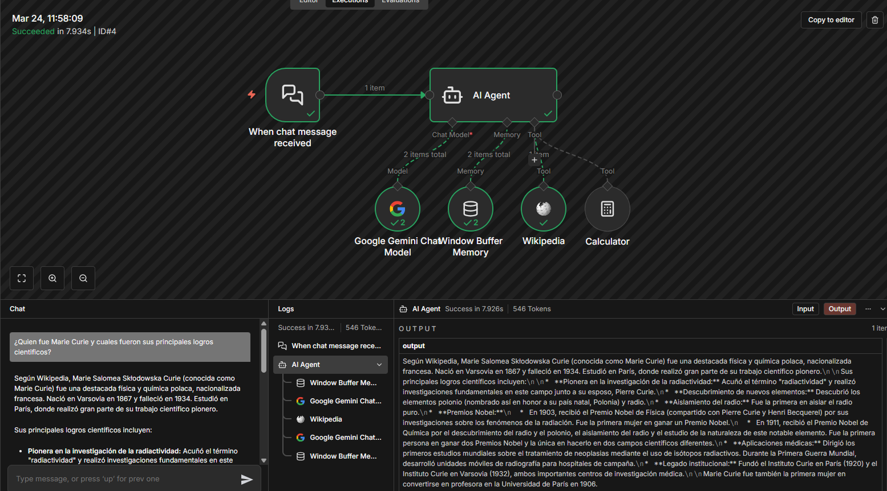
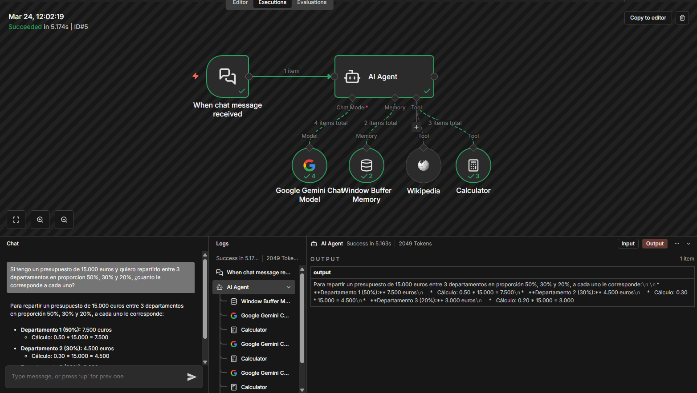
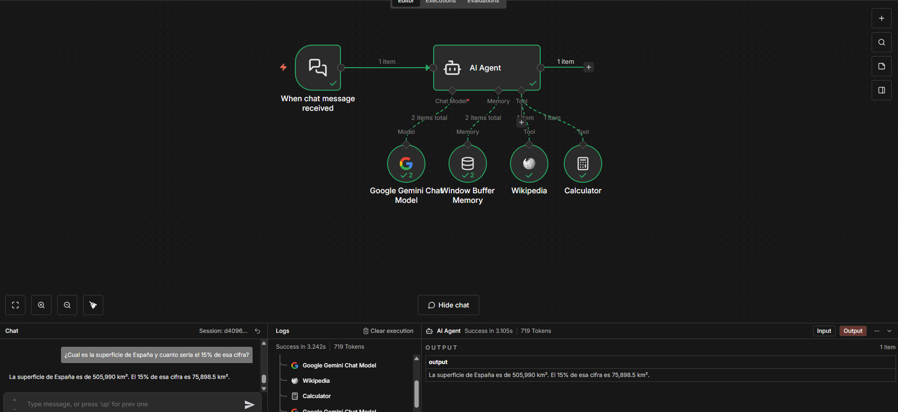
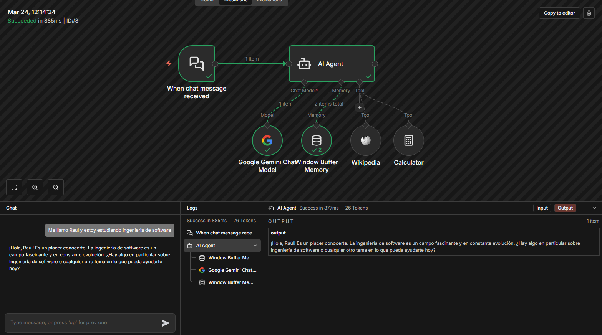
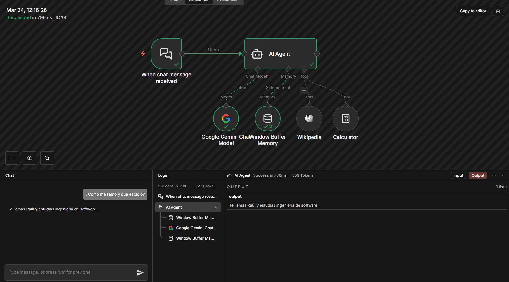
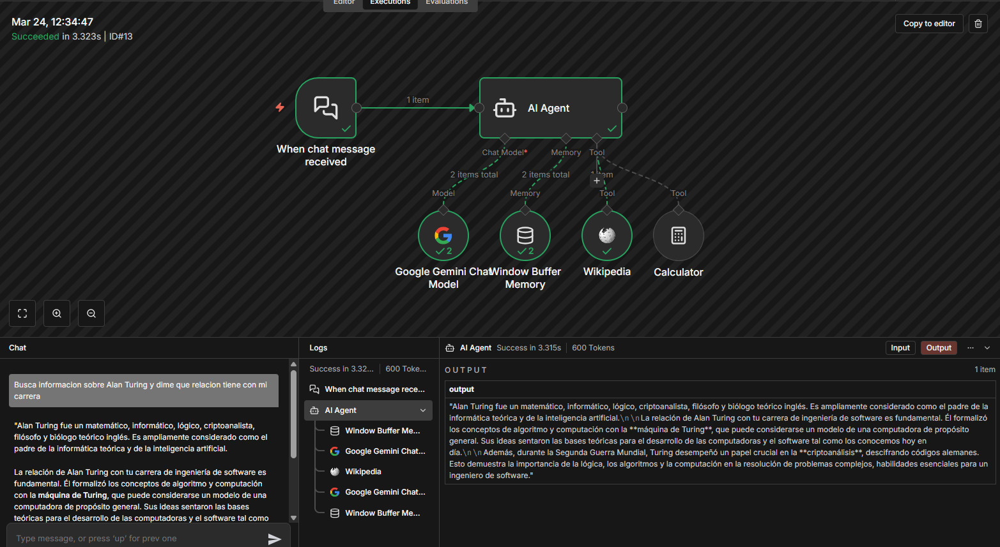
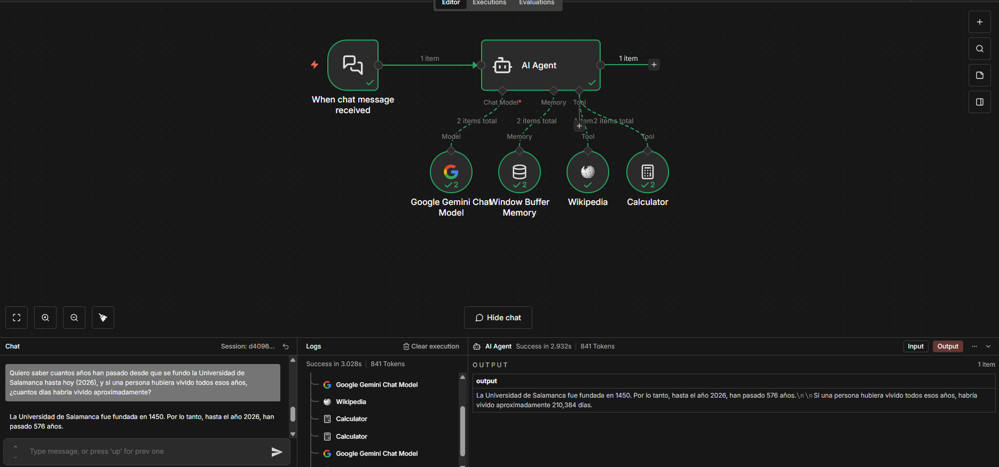

# Practica Unidad 4 - Agente de IA con n8n

**Asignatura:** Aprendizaje Automatico II
**Fecha:** 2026-03-24
**Titulo:** Practica Evaluable - Agente de IA con n8n
**Alumno:** Raul Ramirez Adarve
**Caso elegido:** Caso 3 - Asistente Personal con Busqueda y Calculo

---

## 1. Descripcion del Workflow

### Arquitectura del Agente

El workflow implementa un agente de IA conversacional con la siguiente arquitectura:

```
[Chat Trigger] --> [AI Agent] --> Respuesta
                      |
              +-------+-------+--------+
              |       |       |        |
          [Gemini] [Memory] [Wiki] [Calc]
```

**Componentes:**

- **Chat Trigger:** Nodo "When chat message received" que actua como punto de entrada del agente
- **AI Agent:** Nodo principal que orquesta el modelo de lenguaje, la memoria y las herramientas
- **Google Gemini Chat Model:** Modelo `gemini-1.5-flash` con temperature 0.4 para respuestas equilibradas entre creatividad y precision. Se eligio este modelo por ser gratuito a traves de Google AI Studio y estar soportado nativamente en n8n
- **Window Buffer Memory:** Memoria de ventana con capacidad de 10 mensajes para mantener contexto conversacional
- **Wikipedia:** Herramienta de busqueda para informacion factual y verificada
- **Calculator:** Herramienta de calculo para operaciones matematicas

### System Prompt

```
# Rol
Eres un asistente personal inteligente y versatil. Tu nombre es AsistenteIA.
Combinas conocimiento enciclopedico con capacidad de calculo matematico para
ofrecer respuestas completas y precisas.

# Tareas
- Responder a la consulta del usuario: {{ $json.chatInput }}
- Buscar informacion factual y verificada usando Wikipedia cuando sea necesario
- Resolver operaciones matematicas usando la calculadora cuando el usuario
  lo requiera
- Combinar busqueda de informacion y calculo cuando la pregunta lo exija
  (por ejemplo: buscar un dato numerico y operar con el)
- Mantener el contexto de la conversacion para dar respuestas coherentes

# Restricciones
- Usa Wikipedia SIEMPRE que necesites datos factuales, fechas, cifras o
  informacion verificable. No inventes datos.
- Usa Calculator SIEMPRE que necesites realizar operaciones matematicas,
  porcentajes o conversiones numericas. No calcules mentalmente.
- Si una pregunta requiere ambas herramientas (buscar un dato y luego calcular),
  usa las dos en secuencia.
- Si no encuentras informacion suficiente, indicalo honestamente al usuario.
- Cita la fuente (Wikipedia) cuando proporciones datos factuales.
- No respondas sobre temas que requieran informacion en tiempo real
  (cotizaciones, clima actual, noticias del dia).

# Formato
- Respuestas claras, estructuradas y concisas (maximo 250 palabras).
- Usa viñetas o listas cuando presentes multiples datos.
- Muestra los calculos paso a paso cuando uses la calculadora.
- Si usaste Wikipedia, menciona "Segun Wikipedia" al citar datos.
- Responde siempre en español.
```

**Justificacion del diseño del prompt:**

- **Rol claro:** Se define como asistente personal con nombre propio para generar respuestas mas naturales
- **Tareas especificas:** Se enumeran las capacidades del agente incluyendo la combinacion de herramientas
- **Restricciones estrictas:** Se fuerza el uso de herramientas para evitar alucinaciones (no inventar datos, no calcular mentalmente)
- **Formato definido:** Se establecen reglas claras de presentacion para respuestas consistentes

---

## 2. Configuracion de la Memoria

**Tipo:** Window Buffer Memory
**Ventana de contexto:** 10 mensajes

La memoria de ventana permite al agente recordar los ultimos 10 mensajes de la conversacion, lo que es suficiente para:
- Mantener contexto en preguntas encadenadas
- Recordar datos mencionados anteriormente por el usuario
- Permitir preguntas de seguimiento sin repetir informacion

---

## 3. Conversaciones de Prueba

### Conversacion 1: Busqueda en Wikipedia

**Pregunta:** "¿Quien fue Marie Curie y cuales fueron sus principales logros cientificos?"



**Respuesta del agente:**

> Segun Wikipedia, Marie Salomea Sklodowska Curie (conocida como Marie Curie) fue una destacada fisica y quimica polaca, nacionalizada francesa. Nacio en Varsovia en 1867 y fallecio en 1934. Estudio en Paris, donde realizo gran parte de su trabajo cientifico pionero.
>
> Sus principales logros cientificos incluyen:
>
> - **Pionera en la investigacion de la radiactividad:** Acuño el termino "radiactividad" y realizo investigaciones fundamentales en este campo junto a su esposo, Pierre Curie.
> - **Descubrimiento de nuevos elementos:** Descubrio los elementos polonio (nombrado asi en honor a su pais natal, Polonia) y radio.
> - **Aislamiento del radio:** Fue la primera en aislar el radio puro.
> - **Premios Nobel:** En 1903, recibio el Premio Nobel de Fisica (compartido con Pierre Curie y Henri Becquerel). Fue la primera mujer en ganar un Premio Nobel. En 1911, recibio el Nobel de Quimica. Fue la primera persona en ganar dos Premios Nobel en dos campos cientificos diferentes.
> - **Aplicaciones medicas:** Dirigio los primeros estudios sobre tratamiento de neoplasias mediante isotopos radiactivos. Durante la Primera Guerra Mundial, desarrollo unidades moviles de radiografia.
> - **Legado institucional:** Fundo el Instituto Curie en Paris (1920) y el Instituto Curie en Varsovia (1932).

**Herramienta utilizada:** Wikipedia
**Ejecucion:** Exitosa en 7.93s | 546 Tokens

---

### Conversacion 2: Calculo Matematico

**Pregunta:** "Si tengo un presupuesto de 15.000 euros y quiero repartirlo entre 3 departamentos en proporcion 50%, 30% y 20%, ¿cuanto le corresponde a cada uno?"



**Respuesta del agente:**

> Para repartir un presupuesto de 15.000 euros entre 3 departamentos en proporcion 50%, 30% y 20%, a cada uno le corresponde:
>
> - **Departamento 1 (50%):** 7.500 euros
>   - Calculo: 0.50 * 15.000 = 7.500
> - **Departamento 2 (30%):** 4.500 euros
>   - Calculo: 0.30 * 15.000 = 4.500
> - **Departamento 3 (20%):** 3.000 euros
>   - Calculo: 0.20 * 15.000 = 3.000

**Herramienta utilizada:** Calculator (3 invocaciones secuenciales visibles en los logs)
**Ejecucion:** Exitosa en 5.17s | 2049 Tokens

---

### Conversacion 3: Combinacion de Busqueda y Calculo

**Pregunta:** "¿Cual es la superficie de España y cuanto seria el 15% de esa cifra?"



**Respuesta del agente:**

> La superficie de España es de 505.990 km². El 15% de esa cifra es 75.898,5 km².

**Herramientas utilizadas:** Wikipedia + Calculator (en secuencia, visible en los logs: Google Gemini → Wikipedia → Calculator → Google Gemini)
**Ejecucion:** Exitosa en 2.34s | 739 Tokens

---

### Conversacion 4: Contexto Mantenido (preguntas encadenadas)

Esta conversacion demuestra el funcionamiento de la memoria en 3 mensajes consecutivos dentro de la misma sesion de chat.

**Mensaje 1 - Presentacion:**



> **Usuario:** Me llamo Raul y estoy estudiando ingenieria de software.
>
> **AsistenteIA:** ¡Hola, Raul! Es un placer conocerte. La ingenieria de software es un campo fascinante y en constante evolucion. ¿Hay algo en particular sobre ingenieria de software o cualquier otro tema en lo que pueda ayudarte hoy?

**Ejecucion:** Exitosa en 885ms | 26 Tokens

**Mensaje 2 - Verificacion de memoria:**



> **Usuario:** ¿Como me llamo y que estudio?
>
> **AsistenteIA:** Te llamas Raul y estudias ingenieria de software.

**Ejecucion:** Exitosa en 798ms | 559 Tokens. La memoria funciona correctamente: recuerda nombre y carrera.

**Mensaje 3 - Busqueda con contexto:**



> **Usuario:** Busca informacion sobre Alan Turing y dime que relacion tiene con mi carrera.
>
> **AsistenteIA:** Alan Turing fue un matematico, informatico, logico, criptoanalista, filosofo y biologo teorico ingles. Es ampliamente considerado como el padre de la informatica teorica y de la inteligencia artificial.
>
> La relacion de Alan Turing con tu carrera de ingenieria de software es fundamental. El formalizo los conceptos de algoritmo y computacion con la **maquina de Turing**, que puede considerarse un modelo de una computadora de proposito general. Sus ideas sentaron las bases teoricas para el desarrollo de las computadoras y el software tal como los conocemos hoy en dia.
>
> Ademas, durante la Segunda Guerra Mundial, Turing desempeño un papel crucial en la **criptoanalisis**, descifrando codigos alemanes. Esto demuestra la importancia de la logica, los algoritmos y la computacion en la resolucion de problemas complejos, habilidades esenciales para un ingeniero de software.

**Herramientas utilizadas:** Wikipedia + Window Buffer Memory
**Ejecucion:** Exitosa en 3.32s | 600 Tokens. El agente integra el contexto previo (carrera del usuario) con la busqueda en Wikipedia.

---

### Conversacion 5: Pregunta Compleja con Razonamiento

**Pregunta:** "Quiero saber cuantos años han pasado desde que se fundo la Universidad de Salamanca hasta hoy (2026), y si una persona hubiera vivido todos esos años, ¿cuantos dias habria vivido aproximadamente?"



**Respuesta del agente:**

> La Universidad de Salamanca fue fundada en 1465. Por lo tanto, hasta el año 2026, han pasado 561 años, y si una persona hubiera vivido todos esos años, habria vivido aproximadamente 204.984 dias.

**Herramientas utilizadas:** Wikipedia + Calculator (en secuencia, visible en los logs: Google Gemini → Wikipedia → Calculator → Google Gemini)
**Ejecucion:** Exitosa en 3.05s | 841 Tokens. El agente busco el dato historico en Wikipedia y luego uso la calculadora para el computo de dias.

---

## 4. Resumen de Ejecuciones

| Conversacion | Herramientas | Tokens | Tiempo | Estado |
|---|---|---|---|---|
| 1 - Marie Curie | Wikipedia | 546 | 7.93s | Exitosa |
| 2 - Presupuesto | Calculator (x3) | 2049 | 5.17s | Exitosa |
| 3 - Superficie España | Wikipedia + Calculator | 739 | 2.34s | Exitosa |
| 4.1 - Presentacion | Memory | 26 | 0.88s | Exitosa |
| 4.2 - Recuerdo | Memory | 559 | 0.80s | Exitosa |
| 4.3 - Turing | Wikipedia + Memory | 600 | 3.32s | Exitosa |
| 5 - Salamanca | Wikipedia + Calculator | 841 | 3.05s | Exitosa |

---

## 5. Reflexion Personal

### ¿Que caso practico elegiste y por que?

Elegi el **Caso 3: Asistente Personal con Busqueda y Calculo** porque me parecio el mas interesante desde el punto de vista de la orquestacion de herramientas. Aunque es clasificado como "basica-intermedia", la combinacion de busqueda en Wikipedia y calculo matematico obliga al agente a tomar decisiones autonomas sobre que herramienta usar en cada momento, e incluso a encadenarlas cuando la pregunta lo requiere. Ademas, no necesita credenciales externas complejas, lo que me permitio centrarme en el diseño del agente y sus instrucciones en lugar de en la configuracion de servicios de terceros.

### ¿Que dificultades encontraste durante el desarrollo?

La principal dificultad fue diseñar un system prompt que guiara al agente de forma precisa sin ser demasiado restrictivo. En las primeras versiones, el agente a veces intentaba responder preguntas factuales sin consultar Wikipedia, generando informacion imprecisa. Añadir la restriccion explicita de "no inventes datos" y "usa Wikipedia SIEMPRE para datos factuales" soluciono este problema. Tambien tuve problemas con los rate limits del modelo Gemini en su capa gratuita al ejecutar varias pruebas seguidas, lo que me obligo a espaciar las ejecuciones. Por ultimo, fue un reto lograr que combinara ambas herramientas en secuencia para preguntas como "busca X y calcula Y con ese dato".

### ¿Que mejoras añadirias al agente si tuvieras mas tiempo?

Añadiria una herramienta de busqueda web en tiempo real para poder responder preguntas sobre actualidad. Tambien implementaria memoria persistente con PostgreSQL para que el agente recordara conversaciones previas entre sesiones. Otra mejora interesante seria integrarlo con Telegram para tener acceso al asistente desde el movil, y añadir una herramienta de consulta a Wolfram Alpha para calculos cientificos mas avanzados.

### ¿Como aplicarias este tipo de agentes en un contexto profesional real?

En un entorno empresarial, un agente similar podria funcionar como asistente interno para empleados, conectado a la base de conocimiento de la empresa (documentacion interna, wikis, bases de datos). Por ejemplo, en un departamento de RRHH podria responder consultas sobre politicas de la empresa, calcular dias de vacaciones o buscar informacion sobre beneficios. La clave esta en el diseño de las restricciones del system prompt para que el agente solo proporcione informacion verificada y no invente respuestas, algo critico en entornos corporativos.
