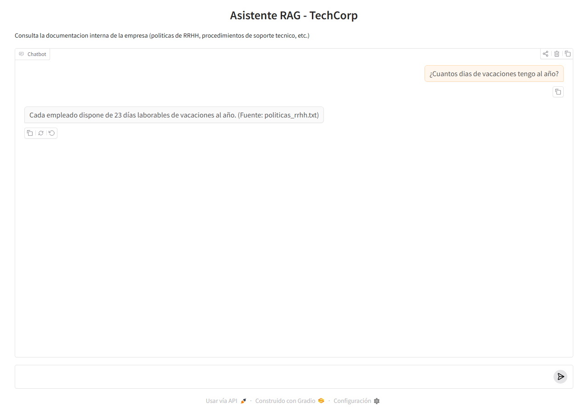

# Practica Unidad 5 - Asistente RAG para Documentacion de Empresa

**Asignatura:** Aprendizaje Automatico II
**Fecha:** 2026-04-14
**Titulo:** Practica Evaluable - Asistente RAG para Documentacion de Empresa
**Alumno:** Raul Ramirez Adarve
**Opcion elegida:** Opcion B - LangChain (Python)

---

## 1. Arquitectura del Sistema

El sistema implementa un pipeline RAG completo con tres fases: ingesta, almacenamiento y recuperacion/generacion.

```
                FASE DE INGESTA (ingesta.py)
    ----------------------------------------------------
    documentos/*.txt
         |
         v
    [DirectoryLoader]   --> carga 2 documentos .txt
         |
         v
    [RecursiveCharacterTextSplitter]
    chunk_size=300, overlap=30
         |
         v
    [GoogleGenerativeAIEmbeddings]   --> gemini-embedding-001
         |
         v
    [ChromaDB (persistente en ./chroma_db)]
    coleccion: empresa_docs  |  25 vectores

                FASE DE CONSULTA (asistente.py)
    ----------------------------------------------------
    Pregunta del usuario (CLI)
         |
         v
    [Embedding de la pregunta] --> gemini-embedding-001
         |
         v
    [Chroma retriever (k=3, similarity)]
         |
         v
    Contexto (3 chunks mas similares) + Pregunta
         |
         v
    [ChatPromptTemplate]  ---> system prompt + contexto inyectado
         |
         v
    [ChatGoogleGenerativeAI]  ---> gemini-2.5-flash-lite, temp=0.3
         |
         v
    Respuesta en lenguaje natural
```

**Componentes principales:**

- **Cargador de documentos:** `DirectoryLoader` recorre la carpeta `documentos/` cargando todos los archivos `.txt` en memoria
- **Splitter:** `RecursiveCharacterTextSplitter` segmenta cada documento en fragmentos de ~300 caracteres con solapamiento de 30, respetando separadores naturales (`\n\n`, `\n`, `. `, ` `)
- **Modelo de embeddings:** `gemini-embedding-001` de Google (768 dimensiones) para convertir chunks y consultas en vectores
- **Base vectorial:** `ChromaDB` local y persistente en `./chroma_db`, coleccion `empresa_docs`
- **Retriever:** busqueda por similitud coseno, recupera los `k=3` chunks mas relevantes para cada consulta
- **LLM generador:** `gemini-2.5-flash-lite` con temperatura 0.3 para respuestas deterministas y fieles al contexto
- **Cadena LCEL:** compone retriever, prompt template, LLM y parser de salida en una sola expresion declarativa

---

## 2. Decisiones Tecnicas

### Opcion elegida: Python + LangChain (B)

Elegi la opcion B porque da control total sobre cada paso del pipeline y genera codigo reproducible en cualquier entorno limpio. Ademas encaja con la base Python usada en las practicas anteriores (notebook de la P3).

### Justificacion del uso de Gemini en lugar de OpenAI

El enunciado indica OpenAI como proveedor por defecto, pero usar la API de OpenAI implica coste economico desde el primer token. He optado por **Google Gemini** (mismo proveedor usado con exito en la Practica 4) porque ofrece capa gratuita suficiente para esta practica y los objetivos de aprendizaje del sistema RAG se cumplen identicamente: el pipeline (ingesta, chunking, embeddings, recuperacion semantica, generacion contextualizada) es exactamente el mismo, solo cambia el proveedor de los modelos. Las equivalencias son:

| Componente | Version enunciado (OpenAI) | Version implementada (Gemini) |
|---|---|---|
| Embeddings | `text-embedding-ada-002` (1536 dims) | `gemini-embedding-001` (768 dims) |
| LLM | `gpt-4o-mini` | `gemini-2.5-flash-lite` |
| Base vectorial | ChromaDB | ChromaDB (igual) |
| Paquete LangChain | `langchain-openai` | `langchain-google-genai` |

### Parametros del sistema

| Parametro | Valor | Justificacion |
|---|---|---|
| `chunk_size` | 300 caracteres | Valor recomendado en el enunciado. Suficiente para capturar una idea completa (un parrafo corto o un apartado) sin mezclar contextos no relacionados |
| `chunk_overlap` | 30 caracteres (10%) | Evita perder contexto en los limites entre chunks cuando un concepto se parte entre dos fragmentos |
| Separadores | `["\n\n", "\n", ". ", " ", ""]` | Se priorizan separaciones naturales para no cortar frases a mitad |
| `k` (documentos recuperados) | 3 | Balance entre contexto suficiente para responder y ruido minimo |
| `temperature` | 0.3 | Respuestas deterministas y apegadas al contexto recuperado |
| Metrica de similitud | cosine (por defecto Chroma) | Estandar para embeddings normalizados |
| Prompt del sistema | Ver `asistente.py` | Incluye instruccion explicita de no inventar informacion y frase exacta para el caso negativo |

### Estructura del proyecto

```
unidad5/
├── documentos/
│   ├── politicas_rrhh.txt
│   └── procedimiento_soporte.txt
├── capturas/                    # Evidencias de ejecucion (Gradio)
├── chroma_db/                   # Base vectorial persistente (ignorada en git)
├── ingesta.py                   # Pipeline de ingesta: carga + split + embeddings + almacenamiento
├── asistente.py                 # Asistente RAG CLI + cadena LCEL reutilizable
├── interfaz_web.py              # Interfaz web con Gradio (bonificacion)
├── pruebas.py                   # Script que ejecuta las 5 consultas y guarda resultados
├── resultados_pruebas.txt       # Output textual completo de las 5 consultas
├── requirements.txt
├── .env.example                 # Plantilla de configuracion (sin credenciales)
└── .gitignore                   # Excluye .env, chroma_db/, __pycache__/
```

---

## 3. Ejecucion del Sistema

### Fase 1 - Ingesta

Salida real de `python ingesta.py`:

```
==================================================
INGESTA DE DOCUMENTOS - Sistema RAG TechCorp
==================================================
Documentos cargados: 2
  - documentos\politicas_rrhh.txt (2074 caracteres)
  - documentos\procedimiento_soporte.txt (2337 caracteres)
Chunks generados: 25
Tamaño medio de chunk: 174 caracteres

Ejemplo de chunk:
  Contenido: POLITICAS DE RECURSOS HUMANOS - TECHCORP...
  Metadata: {'source': 'documentos\\politicas_rrhh.txt'}
Base vectorial creada en: ./chroma_db
Vectores almacenados: 25

Ingesta completada con exito.
```

- 2 documentos cargados (4.411 caracteres en total)
- 25 chunks generados (tamaño medio 174 caracteres)
- 25 vectores almacenados en ChromaDB
- Los chunks tienen tamaño menor que 300 porque el splitter corta en separadores naturales antes de alcanzar el limite

### Fase 2 - Consultas

Una vez ingestados los documentos, el asistente responde consultas por CLI. Los outputs completos (pregunta, documentos recuperados y respuesta) estan en el fichero [resultados_pruebas.txt](resultados_pruebas.txt), generado automaticamente por el script [pruebas.py](pruebas.py) que ejecuta las 5 consultas obligatorias de forma reproducible.

---

## 4. Consultas de Prueba

### Consulta 1: Recuperacion de dato especifico

**Pregunta:** *"¿Cuantos dias de vacaciones tengo al año?"*

Documentos recuperados por el retriever (k=3):
1. `politicas_rrhh.txt` — "2. VACACIONES Y PERMISOS. Cada empleado dispone de 23 dias laborables de vacaciones al año..."
2. `politicas_rrhh.txt` — "hasta 2 dias por semana, previa aprobacion del responsable directo."
3. `politicas_rrhh.txt` — "Los permisos por asuntos propios (maximo 3 dias al año)..."

**Respuesta del asistente:**
> Cada empleado dispone de 23 dias laborables de vacaciones al año. (Fuente: politicas_rrhh.txt)

**Evaluacion:** Correcta, concisa y cita la fuente. Tiempo: 1.21s.

---

### Consulta 2: Respuesta con pasos secuenciales

**Pregunta:** *"¿Cual es el procedimiento para reportar una incidencia tecnica?"*

Documentos recuperados (k=3):
1. `procedimiento_soporte.txt` — "2. PROCESO DE REPORTE. Para reportar una incidencia: a) Acceder al portal... b) Seleccionar la categoria... c) Describir el problema... d) Adjuntar capturas..."
2. `procedimiento_soporte.txt` — "e) Indicar la urgencia y el impacto en el trabajo. El sistema asignara automaticamente un numero de ticket..."
3. `procedimiento_soporte.txt` — "PROCEDIMIENTO DE SOPORTE TECNICO - TECHCORP"

**Respuesta del asistente:**
> Para reportar una incidencia tecnica, debes seguir estos pasos:
>
> a) Acceder al portal de soporte: soporte.techcorp.internal
> b) Seleccionar la categoria correspondiente (Hardware, Software, Red, Accesos)
> c) Describir el problema con el maximo detalle posible
> d) Adjuntar capturas de pantalla si es relevante
> e) Indicar la urgencia y el impacto en el trabajo
>
> El sistema asignara automaticamente un numero de ticket y un tecnico responsable. (Fuente: procedimiento_soporte.txt)

**Evaluacion:** Correcta y completa. El retriever recupero los dos chunks que contenian los pasos (que el splitter habia partido entre dos fragmentos) y el LLM los fusiono en una respuesta coherente. Esto valida la utilidad del solapamiento entre chunks. Tiempo: 1.64s.

---

### Consulta 3: Interpretacion con matiz

**Pregunta:** *"¿Puedo trabajar desde casa todos los dias de la semana?"*

Documentos recuperados (k=3):
1. `politicas_rrhh.txt` — "hasta 2 dias por semana, previa aprobacion del responsable directo."
2. `politicas_rrhh.txt` — "3. TELETRABAJO. La politica de teletrabajo permite hasta 2 dias semanales de trabajo remoto..."
3. `politicas_rrhh.txt` — "1. HORARIO LABORAL. El horario estandar es de 9:00 a 18:00..."

**Respuesta del asistente:**
> No, la politica de teletrabajo permite hasta 2 dias semanales de trabajo remoto. (Fuente: politicas_rrhh.txt)

**Evaluacion:** Correcta. El modelo interpreta la pregunta ("¿todos los dias?") y la contrasta con la politica ("hasta 2 dias"), respondiendo con una negacion razonada en lugar de limitarse a repetir el texto. Tiempo: 1.20s.

---

### Consulta 4: Caso negativo (pregunta sin respuesta)

**Pregunta:** *"¿Cual es el menu del comedor de la empresa?"*

Documentos recuperados (k=3):
1. `politicas_rrhh.txt` — "en las instalaciones de la empresa." (fragmento de codigo de vestimenta)
2. `politicas_rrhh.txt` — "6. CODIGO DE VESTIMENTA. La empresa mantiene un codigo de vestimenta business casual..."
3. `politicas_rrhh.txt` — "1. HORARIO LABORAL. El horario estandar es de 9:00 a 18:00..."

**Respuesta del asistente:**
> No dispongo de informacion sobre ese tema en la documentacion de la empresa. Te recomiendo contactar con el departamento correspondiente.

**Evaluacion:** Exito total en el caso negativo. Aunque el retriever devuelve 3 chunks (la busqueda por similitud siempre devuelve resultados aunque no sean relevantes), el LLM identifica que ninguno contiene informacion sobre el menu del comedor y responde exactamente con la frase estandar definida en el system prompt, sin inventar politicas. Este es el comportamiento critico para evitar alucinaciones en un entorno corporativo real. Tiempo: 1.49s.

---

### Consulta 5: Dato especifico en otro documento

**Pregunta:** *"¿Cada cuanto tiempo debo cambiar mi contraseña?"*

Documentos recuperados (k=3):
1. `procedimiento_soporte.txt` — "5. POLITICA DE CONTRASEÑAS. Las contraseñas deben cumplir los siguientes requisitos: Minimo 12 caracteres, Al menos una mayuscula..., Cambio obligatorio cada 90 dias..."
2. `procedimiento_soporte.txt` — "Tras 5 intentos fallidos, la cuenta se bloquea automaticamente..."
3. `procedimiento_soporte.txt` — "4. MANTENIMIENTO PROGRAMADO..."

**Respuesta del asistente:**
> El cambio de contraseña es obligatorio cada 90 dias. (Fuente: procedimiento_soporte.txt)

**Evaluacion:** Correcta. El retriever cambia de documento (salta a `procedimiento_soporte.txt`) al detectar que la pregunta es sobre seguridad informatica, demostrando que los embeddings discriminan bien entre los dos dominios (RRHH vs soporte IT). Tiempo: 0.93s.

---

## 5. Resumen de Ejecuciones

| # | Consulta | Documento fuente | Evaluacion | Tiempo |
|---|---|---|---|---|
| 1 | Dias de vacaciones | politicas_rrhh.txt | Correcta | 1.21s |
| 2 | Procedimiento incidencia | procedimiento_soporte.txt | Correcta (fusiona 2 chunks) | 1.64s |
| 3 | Teletrabajo todos los dias | politicas_rrhh.txt | Correcta (interpretacion) | 1.20s |
| 4 | Menu del comedor | — | Caso negativo correcto | 1.49s |
| 5 | Cambio de contraseña | procedimiento_soporte.txt | Correcta | 0.93s |

**Tasa de acierto: 5/5 (100%)**, incluido el caso negativo resuelto correctamente.

---

## 6. Reflexion y Mejoras Propuestas

### Dificultades encontradas

La principal dificultad fue diseñar un system prompt que forzara al modelo a no inventar informacion cuando el contexto recuperado no contenia la respuesta. En una primera version, sin la frase estandar de "No dispongo de informacion...", el modelo intentaba dar respuestas genericas con contenido no presente en los documentos. Añadir una instruccion explicita con la frase exacta a usar elimino este comportamiento y cumple con el requisito del caso negativo.

Otra dificultad tecnica fue la compatibilidad de modelos: los nombres de embeddings y modelos de Gemini cambian con frecuencia. Varios modelos documentados en tutoriales (`embedding-001`, `text-embedding-004`, `gemini-1.5-flash`) ya no estan disponibles en la API `v1beta` actual. Tras consultar la lista de modelos soportados dinamicamente con `client.models.list()`, opte por `gemini-embedding-001` para embeddings y `gemini-2.5-flash-lite` para generacion, ambos dentro del plan gratuito.

### Mejoras propuestas

1. **Memoria conversacional persistente:** añadir un `ConversationBufferWindowMemory` para permitir preguntas de seguimiento del tipo "¿y cuantos dias de antelacion?" sin necesidad de repetir el contexto anterior.
2. **Re-ranking de resultados:** introducir un segundo paso que reordene los chunks recuperados usando un cross-encoder (por ejemplo `bge-reranker-v2`) para elevar los fragmentos mas relevantes a las primeras posiciones antes de pasarlos al LLM.
3. **Citas con ubicacion exacta:** enriquecer los metadatos de cada chunk con el numero de apartado (ej. "Seccion 2 - Vacaciones"), para que la respuesta pueda citar no solo el fichero sino la seccion concreta.
4. **Ampliacion de documentos:** añadir mas fuentes (manuales tecnicos, FAQs, plantillas de contratos, PDFs escaneados con OCR) y separarlas por coleccion en ChromaDB o con filtros por metadatos para permitir consultas dirigidas a un dominio concreto.
5. **Evaluacion automatica:** crear un set de preguntas-respuestas de referencia y medir metricas como `context recall`, `faithfulness` y `answer relevancy` con frameworks como RAGAS, para detectar regresiones al modificar parametros.
6. **Integracion con Slack o Teams:** exponer el asistente como bot corporativo accesible desde los canales de comunicacion internos.

---

## 7. Bonificacion: Interfaz Web con Gradio

Se ha implementado una interfaz web en [interfaz_web.py](interfaz_web.py) que reutiliza la misma cadena RAG del CLI mediante el componente `gr.ChatInterface` de Gradio. La interfaz proporciona un chat conversacional con historial visible y ejemplos de preguntas sugeridas.

**Ejecucion:**

```bash
python interfaz_web.py
```

Al lanzarlo, Gradio levanta un servidor local en `http://localhost:7860` con la interfaz lista para usar. Captura real tras realizar la consulta "¿Cuantos dias de vacaciones tengo al año?":



---

## 8. Instrucciones de Reproduccion

```bash
# 1. Activar entorno virtual
venv\Scripts\activate  # Windows
# source venv/bin/activate  # Linux/Mac

# 2. Instalar dependencias
pip install -r requirements.txt

# 3. Configurar API key
cp .env.example .env
# Editar .env y añadir tu GOOGLE_API_KEY

# 4. Ingesta (solo la primera vez)
python ingesta.py

# 5. Ejecutar asistente CLI
python asistente.py

# 6. (Opcional) Ejecutar bateria de 5 consultas de prueba
python pruebas.py

# 7. (Opcional) Interfaz web
python interfaz_web.py
```

Todo el codigo se ha ejecutado en un entorno Windows 11 con Python 3.11 usando el venv del proyecto.
